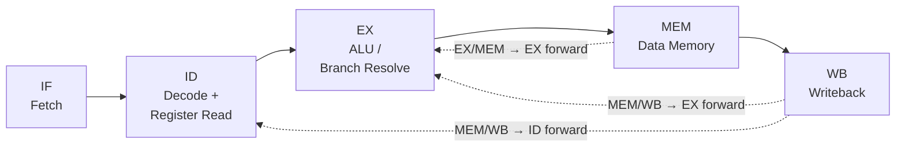

📌 **Note:** This project is the successor to my earlier CPU work. From hand-built 8-bit CPU in Verilog, followed by a Python simulator for a custom 24-bit RISC pipeline. This is the full version: a real RV32I core, written in SystemVerilog, with a proper simulation-based verification suite behind it.

---

# 🧠 32-bit RISC-V CPU (SystemVerilog)

## 🚀 Overview

A RV32I CPU core built from scratch in SystemVerilog — starting from a single-cycle reference implementation, then rebuilt as a 5-stage pipeline with forwarding and hazard detection. Every stage of the design is backed by simulation: **199 directed test cases across 12 testbenches, 100% hand-built functional coverage, 300 constrained-random programs checked against a reference model, and SystemVerilog assertions embedded directly in the RTL.**

---

## 💡 Key Features

- 🧱 **RV32I base ISA** — full instruction set, decoded from raw instruction bits
- ⚙️ **5-Stage Pipeline** (IF → ID → EX → MEM → WB), plus a single-cycle reference core kept side-by-side as a correctness oracle
- 🔁 **Three forwarding paths** (EX/MEM→EX, MEM/WB→EX, MEM/WB→ID) resolving RAW hazards without stalling, plus a single-cycle stall for the one case forwarding can't close (load-use)
- 🧭 **EX-stage branch/jump resolution**, chosen after measuring it beats ID-stage resolution on loop-heavy code
- ✅ **SystemVerilog assertions** embedded directly in the RTL — x0 invariants, pipeline bubble discipline, PC alignment, branch/jump redirect priority
- 📊 **Hand-rolled functional coverage model** — 39 tracked bins (every opcode, every ALU op, both forwarding paths, all branch outcomes, hazard stalls, x0 edge cases), 100% hit
- 🎲 **Constrained-random instruction testing** — 300 randomly generated programs, each checked bit-for-bit against a single-cycle reference model
- 🎥 **Live terminal demo** — watch the core compute Fibonacci numbers in real time

---

## 🧠 Architecture

A taken branch or jump resolves in EX, flushing the 2 instructions
fetched behind it. Load-use hazards (the one case forwarding can't
absorb) cost a single stall cycle in ID. Everything else — back-to-back
dependent ALU ops, values needed one or two instructions later — is
resolved by forwarding with zero stall cost.

---

## 📂 Project Structure

| Path | Contents |
|---|---|
| `rtl/` | Synthesizable SystemVerilog source (core, ALU, regfile, control unit, decoder, pipeline registers, hazard/forwarding units) |
| `verification/` | Testbenches — directed, coverage, and constrained-random |
| `sim/` | PowerShell scripts to build and run each testbench |
| `docs/` | Design notes, decisions log, screenshots |

---

## 🧪 Verification & Testing

| Test Suite | What It Verifies | Cases | Script |
|---|---|---|---|
| ALU | Every ALU operation (ADD, SUB, AND, OR, XOR, SLL, SRL, SRA, SLT, SLTU) | 20 | `run_alu.ps1` |
| Register File | x0 hard-wiring, read/write timing | 10 | `run_regfile.ps1` |
| Control Unit | Opcode → control signal decoding | 34 | `run_control_unit.ps1` |
| Instruction Decoder | Raw instruction field extraction | 11 | `run_decoder.ps1` |
| Single-Cycle Core | End-to-end single-cycle datapath | 16 | `run_riscv_core_singlecycle.ps1` |
| Hazard Unit | Load-use stall detection | 8 | `run_hazard_unit.ps1` |
| Forwarding Unit | EX/MEM and MEM/WB bypass selection | 13 | `run_forwarding_unit.ps1` |
| Pipelined Core | Full 5-stage pipeline integration | 17 | `run_riscv_core_pipelined.ps1` |
| Full-Program Integration | 63-instruction program, dual-core equivalence | 29 | `run_full_program.ps1` |
| CPI Sanity Check | Forwarding keeps CPI near 1.0 | 2 | `run_cpi_sanity.ps1` |
| Compliance-Style Edge Cases | Classic RV32I corner cases (overflow, shift masking, signed/unsigned boundaries) | 21 | `run_compliance.ps1` |
| Fibonacci Smoke Test | Real program correctness, fib(0)–fib(14) | 18 | `run_fibonacci.ps1` |
| **Total directed cases** | | **199** | |

Beyond directed testing:

- **Functional coverage** (`run_coverage.ps1`) — 39/39 bins hit (100%), found and closed two real gaps the directed suite alone had missed.
- **Constrained-random testing** (`run_random.ps1`) — 300 randomly generated instruction streams, each verified against a single-cycle reference model. 300/300 passed.

See `docs/design-notes.md` for the full design and verification decisions log.

---

## 🎥 Live Fibonacci Demo

    cd sim
    .\run_fibonacci_demo.ps1

Runs the Fibonacci program on the pipelined core and narrates each term
as it's computed, replayed at a human-watchable pace on a loop until you
press Ctrl+C — a live look at real code executing on the core rather
than a pass/fail log.

<video src="https://github.com/user-attachments/assets/45ddcba1-58b6-4a33-ab35-b7f494232a5e" controls width="600"></video>

---

## 📸 Results Showcase

**Full 5-stage pipeline — hazard & forwarding integration tests**

  

**63-instruction program run on both cores — dual-core equivalence + measured cycle counts**

  

**Compliance-style edge case testing — classic RV32I corner cases**

  

**Functional coverage report — 100% across 39 tracked bins**

  

**Constrained-random testing — 300 randomized programs vs. reference model**

  

---

## 🛠️ Getting Started

### Prerequisites

Icarus Verilog (`iverilog`, `vvp`).
- macOS: `brew install icarus-verilog`
- Ubuntu/Debian: `sudo apt install iverilog`
- Windows: WSL + apt, or the prebuilt installer from the Icarus site

### Running the tests (PowerShell)

    cd sim
    .\run_alu.ps1
    .\run_regfile.ps1
    .\run_control_unit.ps1
    .\run_decoder.ps1
    .\run_riscv_core_singlecycle.ps1
    .\run_hazard_unit.ps1
    .\run_forwarding_unit.ps1
    .\run_riscv_core_pipelined.ps1
    .\run_full_program.ps1
    .\run_cpi_sanity.ps1
    .\run_compliance.ps1
    .\run_fibonacci.ps1
    .\run_coverage.ps1
    .\run_random.ps1

Each directed suite ends in `ALL TESTS PASSED`; `run_coverage.ps1` ends
in `FULL FUNCTIONAL COVERAGE`; `run_random.ps1` reports a pass/fail/
inconclusive count across its randomized runs.

(`run_alu.sh` also exists for bash/WSL/Git Bash use; the newer modules
only have `.ps1` runners since PowerShell is the primary shell in use.)

---

## Conclusion

This project carries the same goal as the 8-bit CPU and the 24-bit
Python simulator before it — understanding a processor by building one
— but taken all the way to a real, synthesizable RTL implementation with
an actual verification methodology behind it: directed testing,
assertions, functional coverage, and constrained-random testing against
a reference model. See `docs/design-notes.md` for the complete design
and verification decisions log.
